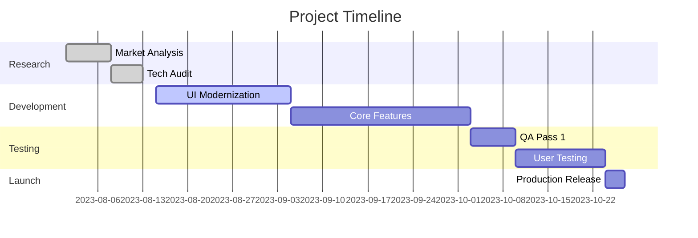

# Flavor Hub Website Modernization

## Overview

Modernization of restaurant website to enhance user experience, improve conversions, and implement contemporary design patterns.

## Objectives

1. Increase conversion rate by 30%
2. Reduce bounce rate below 40%
3. Implement mobile-first responsive design
4. Add interactive culinary experience features
5. Improve average session duration to 4+ minutes

## Key Features

### 1. Design Modernization

- **Sticky Animated Header**
  - Progressive disclosure navigation
  - Mobile menu transformation
  - Cart item counter animation
- **Hero Section Redesign**
  - Full-screen video background
  - Parallax scrolling effects
  - Dynamic CTA buttons
- **Dark Mode Toggle**
  - System-level preference detection
  - Manual override switch
  - Transition animations

### 2. Interactive Features

| Feature            | Description                              | Tech Stack            |
| ------------------ | ---------------------------------------- | --------------------- |
| Menu Filtering     | AJAX-powered filtering with dietary tags | JavaScript, CSS Grid  |
| Virtual Cart       | Real-time order preview with animations  | LocalStorage, GSAP    |
| Recipe Videos      | Embedded step-by-step cooking guides     | YouTube API, Modal UI |
| Reservation System | Table booking with time slots            | FullCalendar, Node.js |

### 3. Technical Requirements

```javascript
// Sample reservation system config
const reservationConfig = {
  timeSlots: ['17:00', '18:30', '20:00', '21:30'],
  maxPartySize: 8,
  bookingWindow: 30, // days
  confirmation: {
    email: true,
    SMS: false,
  },
};
```

### 4. Design Guidelines

- **Color Scheme**
  - Primary: `#2a2a2a` (Anthracite)
  - Secondary: `#e74c3c` (Cinnabar)
  - Accent: `#f1c40f` (Goldenrod)
- **Typography**
  - Headings: "Playfair Display" (serif)
  - Body: "Inter" (sans-serif)
- **UI Elements**
  - 8px border radius
  - 1.5px subtle gradients
  - Micro-interactions on hover

## User Stories

1. As a foodie, I want to filter menu items by dietary needs
2. As a busy professional, I need quick table reservations
3. As a visual learner, I want video recipe guides
4. As a returning customer, I expect personalized offers

## Success Metrics

- 📈 40% increase in contact form submissions
- 📱 60% mobile conversion rate
- 🕒 25% reduction in page load time
- ⭐ 4.8+ average review score

## Timeline



## Team Structure

- **Product Owner**: Feature prioritization
- **UX Designer**: Interaction flows
- **Frontend Dev**: React implementation
- **Backend Dev**: API development
- **QA Engineer**: Cross-browser testing
