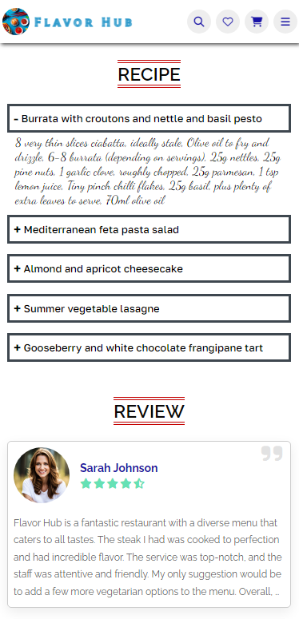
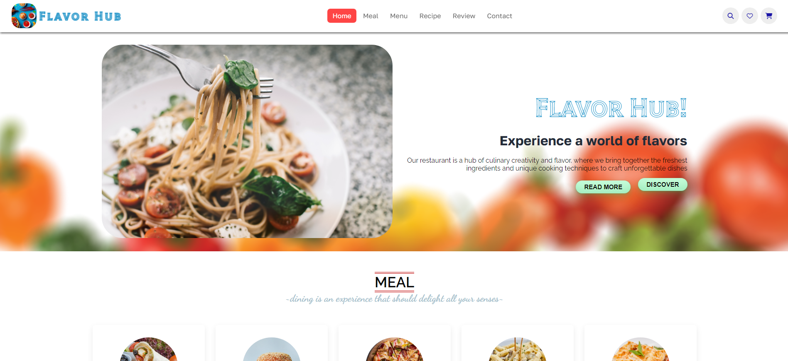

# Flavor Hub 🍽️

Welcome to Flavor Hub - a modern, responsive restaurant website with dark mode support and interactive features. This project is a responsive website developed using HTML, CSS, and JavaScript, creating an immersive and user-friendly experience for food enthusiasts. The majority of the images and content have been generated with the assistance of AI tools, ensuring a visually appealing and diverse culinary showcase.

### Core Features

- Responsive design for all devices
- Dark mode support with system preference detection
- Interactive menu with filtering options
- Dynamic recipe section with expandable steps
- Customer reviews with star ratings
- Contact form with validation
- Social media integration

- **Fully Responsive Design:** Flavor Hub is designed to provide an optimal viewing and interaction experience across a wide range of devices, from desktops to mobile phones.

<p align="center">
    
</p>

- **AI-Generated Content:** The majority of the images and textual content on Flavor Hub have been generated with the help of AI tools, contributing to a unique and innovative presentation.

<p align="center">
    
</p>

- **Menu Showcase:** Explore the diverse menu featuring a fusion of international cuisines, from succulent steaks to mouth-watering desserts.

<p align="center">
    
</p>

### Design Elements

- Modern color scheme with CSS variables
- Smooth transitions and animations
- Hover effects on interactive elements
- Card-based layout for meals and menu items
- Custom scrollbars
- Floating action buttons
- Sticky header with navigation

### Technical Features

- CSS Grid and Flexbox layouts
- CSS Variables for theming
- Responsive typography with clamp()
- Modern CSS animations
- Accessibility support
- Performance optimizations

## 🚀 Getting Started

### Prerequisites

- Modern web browser
- Basic understanding of HTML, CSS, and JavaScript

### Installation

1. Clone the repository to your local machine:

```bash
git clone https://github.com/halil-yesilyurt/flavor-hub.git
```

2. Open the project directory:

```bash
cd flavor-hub
```

3. Open the index.html file in your preferred web browser.

## 🎨 Customization

### Colors

The website uses CSS variables for easy color customization. Edit the following variables in `style.css`:

```css
:root {
  --primary-color: #ff6b6b;
  --secondary-color: #4ecdc4;
  --background-color: #ffffff;
  --surface-color: #f8f9fa;
  --accent-color: #ffd93d;
  --text-color: #2d3436;
  --text-secondary: #636e72;
  --border-color: #dfe6e9;
  --shadow-color: rgba(0, 0, 0, 0.1);
}
```

### Dark Mode

Dark mode colors can be customized by modifying the `[data-theme="dark"]` variables:

```css
[data-theme='dark'] {
  --background-color: #1a1a1a;
  --surface-color: #2d2d2d;
  --text-color: #ffffff;
  --text-secondary: #b2bec3;
  --border-color: #404040;
  --shadow-color: rgba(0, 0, 0, 0.3);
}
```

## 🤝 Contributing

1. Fork the repository
2. Create your feature branch (`git checkout -b feature/AmazingFeature`)
3. Commit your changes (`git commit -m 'Add some AmazingFeature'`)
4. Push to the branch (`git push origin feature/AmazingFeature`)
5. Open a Pull Request

## 📝 License

This project is licensed under the MIT License - see the [LICENSE](LICENSE) file for details.
