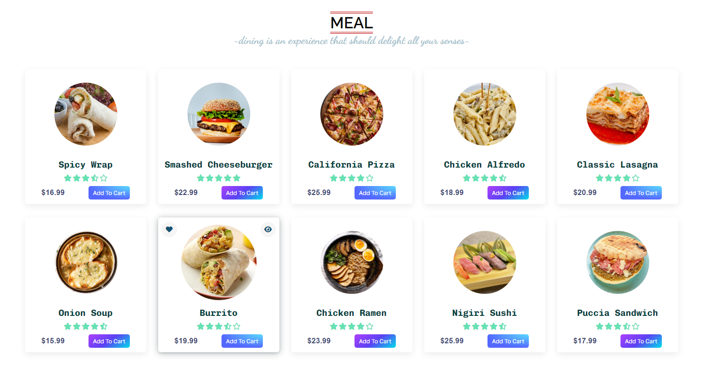

# 🍽️ Flavor Hub - Modern Restaurant Website

Welcome to Flavor Hub - your ultimate culinary destination for exquisite tastes. This project showcases a modern, responsive website developed using HTML, CSS, and JavaScript, creating an immersive and user-friendly experience for food enthusiasts.

## ✨ Features

### Core Features
- **Fully Responsive Design:** Optimized viewing experience across all devices
- **Modern UI/UX:** Clean, intuitive interface with smooth animations
- **Dark Mode Support:** Toggle between light and dark themes
- **Interactive Menu:** Dynamic filtering and sorting options
- **Real-time Cart Updates:** Instant feedback on order modifications
- **Smooth Scrolling:** Enhanced navigation experience
- **Accessibility Support:** ARIA labels and semantic HTML

### Design Elements
- **Modern Color Scheme:**
  - Light Theme: Clean whites and bold accents
  - Dark Theme: Sophisticated dark surfaces with contrasting elements
- **Typography:**
  - Primary: "Playfair Display" for elegant headings
  - Body: "Inter" for clear readability
- **Micro-interactions:**
  - Hover effects on cards and buttons
  - Smooth transitions between states
  - Loading animations

### Technical Features
- **Performance Optimized:**
  - Lazy loading images
  - Minified CSS/JS
  - Optimized assets
- **Local Storage:**
  - Theme preference persistence
  - Cart item storage
- **Modern CSS:**
  - CSS Grid and Flexbox
  - CSS Variables
  - Modern animations

## 🛠️ Technologies Used

&nbsp;
&nbsp;
&nbsp;


## 📥 Installation

1. Clone the repository:
```bash
git clone https://github.com/halil-yesilyurt/flavor-hub.git
```

2. Navigate to project directory:
```bash
cd flavor-hub
```

3. Open index.html in your browser or use a local server:
```bash
# Using Python
python -m http.server 8000

# Using Node.js
npx serve
```

## 🚀 Usage

1. **Navigation:**
   - Use the responsive navigation menu to explore different sections
   - Toggle dark mode using the floating theme button
   - Smooth scroll to sections

2. **Menu Interaction:**
   - Browse through meal categories
   - Add items to cart
   - View detailed descriptions

3. **Contact Form:**
   - Fill out the contact form for inquiries
   - Receive confirmation feedback

## 🎨 Customization

1. **Colors:**
   - Edit CSS variables in `style.css`
   - Modify dark theme colors in `dark-mode.css`

2. **Content:**
   - Update menu items in the HTML
   - Modify images in the `img` directory

## 🤝 Contributing

1. Fork the repository
2. Create your feature branch:
```bash
git checkout -b feature/AmazingFeature
```
3. Commit your changes:
```bash
git commit -m 'Add some AmazingFeature'
```
4. Push to the branch:
```bash
git push origin feature/AmazingFeature
```
5. Open a Pull Request

## 📸 Screenshots

<p align="center">
    
    
    
</p>

## 📄 License

This project is licensed under the MIT License - see the [LICENSE](LICENSE) file for details.

## 🙏 Acknowledgments

- Icons by [Font Awesome](https://fontawesome.com)
- Fonts from [Google Fonts](https://fonts.google.com)
- Images generated with AI tools
